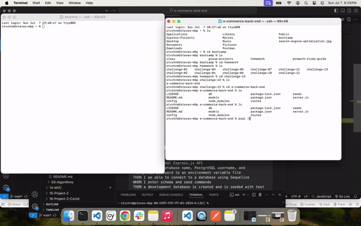

<!-- TABLE OF CONTENTS -->
<details>
  <summary>Table of Contents</summary>
  <ol>
    <li>
      <a href="#about-the-project">About The Project</a>
    </li>
    <li>
      <a href="#getting-started">Getting Started</a>
      <ul>
        <li><a href="#prerequisites">Prerequisites</a></li>
        <li><a href="#installation">Installation</a></li>
      </ul>
    </li>
    <li><a href="#link-to-demo">Link to Demo</a></li>
    <li><a href="#license">License</a></li>
    <li><a href="#contact">Contact</a></li>
    <li><a href="#acknowledgments">Acknowledgments</a></li>
  </ol>
</details>

<!-- ABOUT THE PROJECT -->
## About The Project
E-Commerce Back End Demo



This project was about creating a back end for an e-commerce site by modifying starter code. Additionally, this is a great way to test for RESTful CRUD operations. I selected to use Postman instead of Insominia. These work the same. 


<!-- GETTING STARTED -->
## Getting Started

Please follow these steps if you'd like to clone the repo so you can can see the files yourself

### Prerequisites

Please have a GitHub account and set up your SSH key so you may git pull the latest changes to the repository. It's
reccomended to install Visual Studio code as well.

### Installation

1. Clone the repo
   ```sh
   git clone git@github.com:stvrmrz/e-commerce-back-end.git
   ```
3. Open the repo 
   ```sh
   cd e-commerce-back-end
   ```
4. Open with VS Code
   ```sh
   code .
   ```

<!-- USAGE EXAMPLES -->
## Link to Demo

_Here is a link to my [E-commerce and API Test Walthrough](https://app.screencastify.com/v3/watch/HqKa66RvWp2chXVYySCB)_

<!-- ROADMAP -->
## Roadmap

GIVEN a functional Express.js API
- [x] WHEN I add my database name, PostgreSQL username, and PostgreSQL password to an environment variable file
      THEN I am able to connect to a database using Sequelize
- [x] WHEN I enter schema and seed commands
      THEN a development database is created and is seeded with test data
- [x] WHEN I enter the command to invoke the application
      THEN my server is started and the Sequelize models are synced to the PostgreSQL database
- [x] WHEN I open API GET routes in Insomnia for categories, products, or tags
      THEN the data for each of these routes is displayed in a formatted JSON
- [x] WHEN I test API POST, PUT, and DELETE routes in Postman
      THEN I am able to successfully create, update, and delete data in my database

See the [closed issues](https://github.com/stvrmrz/e-commerce-back-end/issues/1) for a full list of features.

<!-- LICENSE -->
## License

Distributed under the MIT License. See `LICENSE.txt` for more information.

<!-- CONTACT -->
## Contact

Steve Ramirez - [@stvrmrz](https://twitter.com/stvrmrz) - stevearamirez@gmail.com

Project Link: [https://github.com/stvrmrz/e-commerce-back-end](https://github.com/stvrmrz/e-commerce-back-end)

<!-- ACKNOWLEDGMENTS -->
## Acknowledgments

Here are some of the resources that I used that I want to give credit to:

* [othneildrew Best-README-Template](https://github.com/othneildrew/Best-README-Template)
* [BCS Support Tutor](https://2u-20.wistia.com/medias/trfd1jx6o2)
* [AskBCS Learning Assistant]